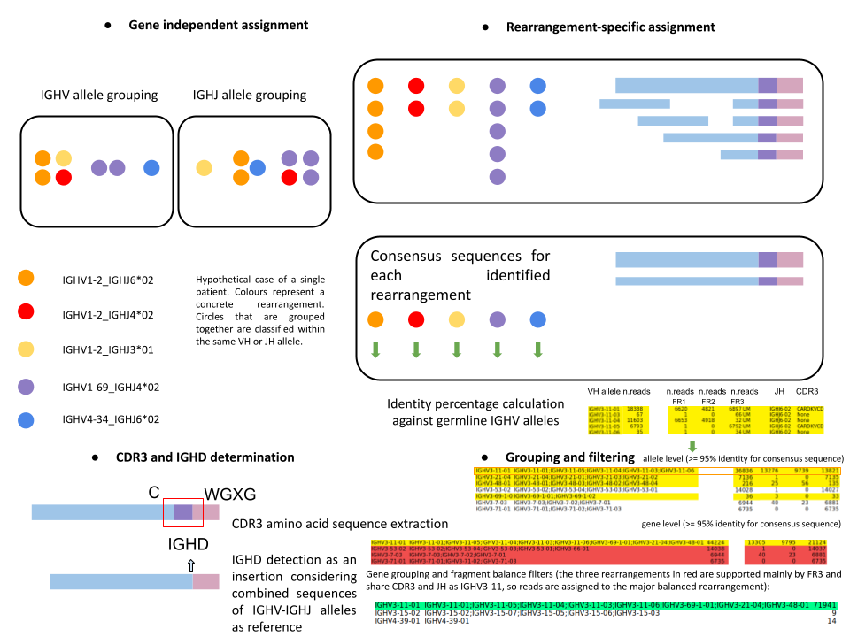

# B-MyRepCLL
pipeline for a consensus-oriented analysis of B-cell clones

The strategy is mapping reads separately against the different IMGT gene segments references, and following a clone-centered determination, achieved with the obtention of a consensus sequence. B-cell rearrangements are defined after IGHV-IGHJ correspondence determination and a specific procedure has been designed to cope with unspecific mapping and gene-call primer biases, and the calculation of the clonal fraction  the unique profile of each patient. 

The first module, src/pipeline.py, annotates VDJ calls and mutational status for all the IGHV alleles found per patient. The second module, src/onlyclonality.py, generates filtering steps for the minimization of artifacts and outputs homology_resume*.xlsx with the final results, with a calculation of the clonal and subclonal fraction on each sample.

For installation, just clone the repository.

### REQUIREMENTS
bwa 0.7.15 or above\n
bamtools 2.4 or above
bcftools 1.7 or above
bedtools 2.26 or above
bbduk(bbtools), repair(bbtools) BBMap version 38 or above
emboss water 6.6.0 or above
samtools 1.7 or above
freebayes 1.1.0 or above
seqtk 1.2 or above
Python
R

#### PIP INSTALL REQUIRED PACKAGES
pip install -r requirements.txt (Python 2), or pip3 install -r requirements.txt (Python 3)

#### RECOMMENDED ARGUMENTS (DEFAULT WORKFLOW VALIDATED WITH CLL DATA)
python B-MyRepCLL/src/pipeline.py --pipeline -f $fastqfilesFolder -o $outputDir -v -p$nproc --basal --primers $FASTAfileVHprimers --cdr3s > log.log

#### AUTOMATIC EXECUTION OF THE PIPELINE WITH DEFAULT VALIDATED PARAMETERS, FINAL SUMMARY FILES AND QUALITY CONTROL
python B-MyRepCLL/launch-default.py $fastqfilesFolder $coverage_threshold $outputDir

This mode has requirements of other repositories:
https://github.com/afuentri/QC
